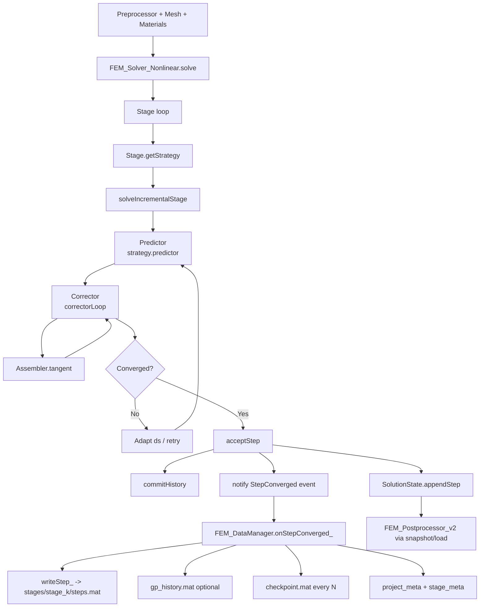
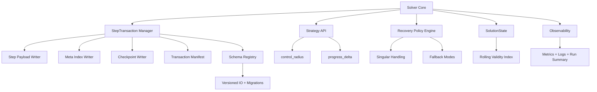

# Architecture Deep Review — Robust Solver + Data Pipeline

Date: 2026-04-17  
Role perspective: Lead Architect Engineering

## 1) Executive Summary

The current redesign is strong in three areas: (i) **strategy-based nonlinear solving**, (ii) **append-only in-memory state**, and (iii) **event-driven persistence**. The implementation has clear boundaries among stage orchestration (`FEM_Solver_Nonlinear`), incremental strategy (`IncrementalStrategy` subclasses), state archive (`SolutionState`), and persistence (`FEM_DataManager`).

The key risks are concentrated in:  
1. **step termination semantics** for arc-length stages,  
2. **fault-tolerance behavior** in persistence and checkpointing,  
3. **memory-mode correctness** under rolling retention, and  
4. **operability gaps** (observability, restart guarantees, and schema/version governance).

## 2) Current Architecture Diagram

## 3) Evidence-Based Deep Review

### 3.1 Solver Orchestration (Good)

- The solver has a **single unified entry point** (`solve`) that validates options, loops over stages, initializes stage state, and dispatches through strategy abstraction; this is architecturally clean and extensible.
- Stage execution is centralized in `solveIncrementalStage`, reducing duplicated control logic.

### 3.2 Data Pipeline (Good)

- Persistence is **event-driven**: converged-step event emits payload and DataManager persists immediately.
- Disk layout is stage-scoped (`stages/stage_xx`) and supports restart workflows.
- The solution archive (`SolutionState`) keeps a compact history interface and separates runtime mutation from postprocessing snapshots.

## 4) Architectural Loopholes / Risks

### L1 — Progress metric coupling risk in arc-length loop

In `solveIncrementalStage`, stage completion is controlled by `accumulated < Stage.Duration`, and `accumulated` is advanced by `trial_ds`. This assumes arc-length radius is a faithful proxy for stage duration progression. If strategy behavior or constraints decouple ds from meaningful load/time advance, termination can be inaccurate.

**Impact:** under/over-stepping a stage target and inconsistent comparability between stages.

### L2 — Trial-loop singular handling reduces recoverability

On singular predictor tangent (`rcond < 1e-13`), the trial loop `break`s immediately from retries instead of shrinking radius and retrying from the same increment in a controlled way.

**Impact:** avoidable stage aborts near limit points.

### L3 — Persistence is not atomic at step transaction boundary

`writeStep_` updates multiple artifacts (`steps.mat`, optional `gp_history.mat`, stage meta, project meta, checkpoint) without a transaction marker or two-phase commit.

**Impact:** process interruption can leave mixed state across files (step written but meta not updated, etc.), complicating deterministic restart and auditability.

### L4 — Checkpoint policy may lose latest converged work

Checkpoint is written only every `CheckpointInterval` steps. If a run stops between intervals and restart depends on checkpoint instead of step replay, data-loss window exists.

**Impact:** avoidable recomputation and potential operator confusion.

### L5 — Rolling memory mode semantics are lossy but not indexed as lossy

In `SolutionState.appendStep`, rolling mode zeroes old columns but keeps global `StepCount`; external consumers reading `[1:StepCount]` can observe zeroed pseudo-history without explicit validity metadata.

**Impact:** silent analytical corruption risk if downstream tools assume complete contiguous history.

### L6 — Debug logging in hot persistence path

`onStepConverged_` currently prints debug lines on every converged step.

**Impact:** noisy logs and possible I/O overhead in large analyses.

### L7 — Missing explicit schema/version governance for persisted artifacts

MAT/JSON structures are written but the architecture does not show strict schema version enforcement and migration boundaries.

**Impact:** backward compatibility fragility across solver/data evolution.

## 5) Proposed Architectural Enhancements

### E1 — Introduce an explicit `StepTransaction` model (high priority)

Implement a per-step manifest with status: `started -> persisted -> indexed -> checkpointed`.

- Write `step_XXXXX` payload first.
- Write transaction status file (`txn_XXXXX.json`) atomically.
- Update stage/project metadata only after payload success.
- On restart, reconcile by scanning latest valid transaction.

This eliminates ambiguity after interruptions.

### E2 — Separate **progress coordinate** from **solver radius** (high priority)

Add explicit stage progress scalar (e.g., `xi in [0,1]` or physical load/time increment from strategy callback), rather than accumulating `trial_ds` directly. Strategy should expose both:

- `control_radius` (numerical conditioning knob), and
- `progress_delta` (stage completion metric).

### E3 — Robust singular recovery protocol (high priority)

Replace immediate singular `break` with bounded recovery policy:

1. shrink radius,
2. optionally enable line search / quasi-Newton fallback,
3. retry predictor-corrector,
4. only abort after structured policy exhaustion.

### E4 — Snapshot/checkpoint policy hardening (medium priority)

- Force checkpoint on stage finalize.
- Optionally force checkpoint on graceful solver exit.
- Add restart preference hierarchy: `checkpoint -> steps replay -> last consistent transaction`.

### E5 — Rolling history validity indexing (medium priority)

For rolling mode, maintain explicit validity window metadata:

- `firstValidStep`, `lastValidStep`, and mapping from logical step to buffer slot.
- Expose API that prevents consumers from reading evicted steps as real data.

### E6 — Observability and operations envelope (medium priority)

- Replace ad-hoc prints with leveled logger (`DEBUG/INFO/WARN/ERROR`).
- Add per-stage metrics: retries, singular events, average iterations, ds shrink count, checkpoint latency.
- Emit a run summary artifact for CI and benchmark governance.

### E7 — Persistence schema versioning and migrations (medium priority)

- Add explicit `schema_version` in stage/project metadata.
- Create migration handlers for major format changes.
- Add compatibility tests for loading N-1/N-2 versions.

## 6) Target Architecture (Enhanced)

## 7) Implementation Roadmap

1. **Wave A (stability first):** E1, E3, E4.  
2. **Wave B (correctness + scale):** E2, E5.  
3. **Wave C (operability + longevity):** E6, E7.

## 8) Governance Gates

- Gate G1: fault injection (kill process mid-step) proves deterministic restart.
- Gate G2: stage-progress correctness under nontrivial arc-length paths.
- Gate G3: rolling-mode API blocks invalid historical reads.
- Gate G4: schema migration tests pass for previous artifact versions.

